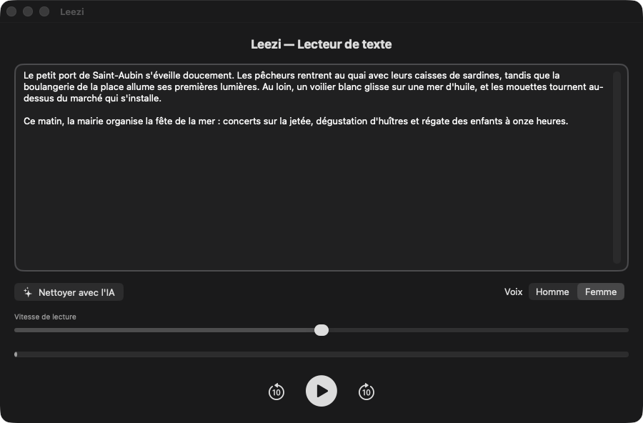

# Leezi

A text-to-speech reader for macOS (SwiftUI). Drop a file or paste some text, then listen to it with a male or female voice — play / pause, skip back or forward 10 seconds, adjust the reading speed — and optionally clean the text up with an LLM through Ollama Cloud (removes page numbers, broken line breaks, artefacts from PDFs…).

> The UI is in French and the voice filter targets the French system voices.

## Screenshot

*Sample text written for the demo.*



## Ollama Cloud API key (optional, for "Nettoyer avec l'IA")

1. Copy `Config/Secrets.swift.example` to `Sources/Leezi/Secrets.swift`.
2. Replace `COLLE_TA_CLE_ICI` with your Ollama Cloud API key (<https://ollama.com/settings/keys>).

`Sources/Leezi/Secrets.swift` is git-ignored so the key is never committed. The file must exist for the project to compile.

## Run in development

```bash
swift run
```

## Build the macOS app

```bash
./build_app.sh
open Leezi.app
```

## Notes

- Speech uses the macOS system voices (`AVSpeechSynthesizer`); the male / female switch filters the installed French voices. Add more voices in System Settings › Accessibility › Spoken Content.
- The default Ollama Cloud model is `gpt-oss:20b-cloud` (see `Sources/Leezi/OllamaClient.swift`).
- Requires macOS 14 or later.
